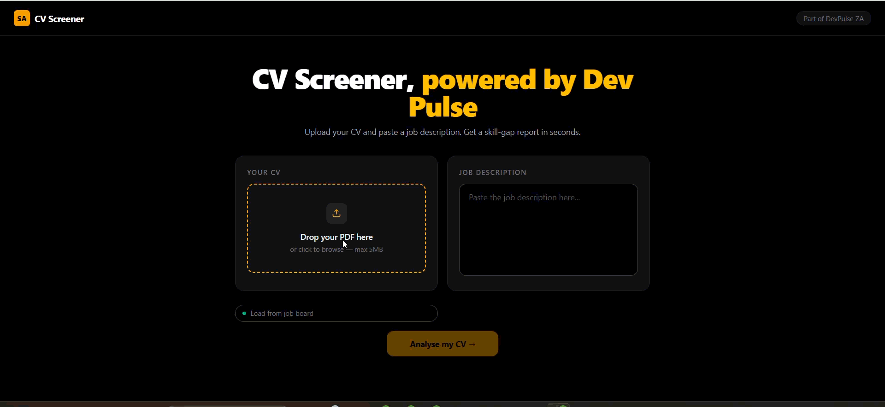

# CV Screener

> Upload your CV. Paste a job description. Get an AI-powered skill-gap report in seconds.

* * *

## What It Does

Drop in a PDF CV and a job description. The backend extracts the CV text, sends both to an LLM, and returns a structured report showing:

* Match score — weighted across hard requirements, technical skills, experience, and soft skills
* Missing skills — what the JD requires that your CV doesn't mention
* Matched skills — highlighted across both documents in a side-by-side diff view
* Recommendations — specific suggestions to close the gaps

* * *

## Tech Stack

| Layer | Technology |
| --- | --- |
| Frontend | React + Vite + Tailwind CSS |
| PDF extraction | `pdf-parse` v1.1.1 |
| File upload | `multer` — 5MB limit, PDF only |
| AI analysis | Groq API — `llama-3.3-70b-versatile`, temperature 0, JSON-only output |
| Backend | Node.js + Express |
| Database | RDS MySQL — reads job listings from SA DevJobs |
| Secrets | AWS SSM Parameter Store |
| Hosting | EC2 t3.micro (API) + S3 + CloudFront (React) |
| Process manager | PM2 |

* * *

## Local Development

    git clone https://github.com/mssdev/cv-screener.git
    cd cv-screener
    
    # Backend
    cd server
    cp .env.example .env   # add your Groq API key
    npm install
    node index.js          # starts on :3003
    
    # Frontend (separate terminal)
    cd ../client
    npm install
    npm run dev
